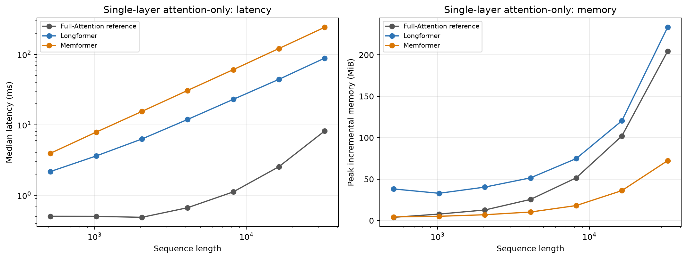

# B 角色详细实验文档：TinyLM + TinyStories 上的 Longformer 与 Memformer 比较

实验日期：2026-09-04  
文档更新时间：2026-09-05
协议版本：`tinystories_tinylm_v1`  
执行配置：`three_day_validation_screening_v1`  
实验角色：B（Longformer + Memformer）  
实验状态：已完成 validation screening  
硬件：NVIDIA GeForce RTX 4090 24GB，实际运行时仅可见 1 张 GPU  

> 本文记录的是统一 TinyLM/TinyStories 条件下的 10M-token 验证集筛选实验，以及随后完成的 100M-token 扩展。它不是 Longformer 或 Memformer 原论文的严格复现，也不是多随机种子、充分收敛或论文级最终实验。文中把实测结果、理论机制和仍待验证的推断分开陈述。

只需快速查看关键结果时，见 [PERSON_B_TINYLM_SIMPLE_RESULT_REPORT.md](PERSON_B_TINYLM_SIMPLE_RESULT_REPORT.md)。

## 摘要

本实验比较两种不同的长历史处理路径：Longformer 使用固定因果局部窗口，让信息通过堆叠层逐步向后传播；Memformer 使用固定数量的 recurrent memory slots，把上一 segment 的压缩状态传给下一 segment。两个方法共享相同 TinyLM 非 attention 主干、TinyStories token 顺序、优化器、有效 batch 和随机种子；先完成 10M-token screening，随后在数据盘上将同一冻结配置扩展到 100M tokens。

在本次 `seed=17`、训练上下文 512、10M-token screening 中（100M 扩展结果见第 8.3/9.1 节）：

| 指标 | Longformer | Memformer | Memformer 相对变化 |
|---|---:|---:|---:|
| 冻结配置 | left window=128 | segment=128，slots=64 | - |
| 参数量 | 29,925,504 | 33,466,752 | +11.83% |
| 完整 validation NLL | 2.883914 | **2.845559** | -1.33% |
| 完整 validation PPL | 17.884141 | **17.211176** | -3.76% |
| 统一训练流程吞吐 | 14,003.66 tok/s | **15,733.62 tok/s** | +12.35% |
| run-level peak allocated | 6.80 GiB | **2.63 GiB** | -61.28% |
| run-level peak reserved | 7.67 GiB | **3.93 GiB** | -48.83% |
| 10M-token 训练阶段墙钟时间 | 714.10 s | **635.58 s** | -11.00% |

在这些限定条件下，Memformer 表现出更好的 validation NLL/PPL、训练流程吞吐和训练运行峰值显存，但它使用了约 11.8% 更多参数。另一方面，在 batch=1 的冻结 checkpoint 前向测试中，当前 Memformer Python/PyTorch adapter 明显慢于 Longformer；两者在 512 到 32,768 的所有测试长度上又都慢于高度优化的 PyTorch SDPA Full-Attention 参考。这说明较低的理论复杂度不会自动转化为较低的端到端延迟，kernel、Python 循环、segment 调度和词表投影都可能成为主导成本。

随后完成的 100M-token 扩展改变了质量排序，但没有改变资源侧趋势：Longformer 完整 validation NLL/PPL 为 `1.807748/6.0967`，Memformer 为 `1.865966/6.4622`，前者分别低约 3.22% 和 5.99%；Memformer 的训练流程吞吐仍高约 14.03%，训练时间低约 12.31%，peak allocated 低约 61.28%。因此，10M 时的 Memformer 质量优势不能外推为充分训练后的普遍优势。

跨 segment 机制诊断进一步显示：Longformer 在 6 层、left window=128 时，单 token 的理论最大传播距离约为 768；当序列长度达到 1,024 后，开头 128-token 扰动对末端 logits 的影响归零。Memformer 到长度 4,096 仍保留非零影响，但影响明显衰减。该结果只证明两者存在不同的信息通路，不证明 Memformer 能无损找回早期事实。

## 1. 实验背景与研究问题

### 1.1 六框架项目中的位置

完整三人分工如下：

| 角色 | 负责方法 | 主要比较主题 |
|---|---|---|
| A | Linformer + Performer | 低秩投影与随机特征近似 |
| B | Longformer + Memformer | 固定局部窗口与跨 segment recurrent memory |
| C | Reformer + Keyformer | LSH 历史连接与推理期 KV-cache 选择 |

B 角色的任务不是判断六种方法的总排名，而是回答一个较窄且可验证的问题：在相同小型语言模型、数据和训练预算下，固定局部窗口与固定容量循环记忆分别带来什么样的质量、速度、显存和远距信息通路特征。

### 1.2 研究问题

本实验围绕以下四个问题展开：

1. **质量问题（RQ1）**：相同 TinyLM 公共主干下，在 10M 与 100M training-token 预算时，哪种机制得到更低的 TinyStories validation NLL/PPL；质量排序是否依赖训练预算？
2. **训练资源问题（RQ2）**：在 RTX 4090 上，两种实现的训练流程吞吐、墙钟时间和峰值显存有何差异？
3. **长度扩展问题（RQ3）**：冻结 checkpoint 在 512 至 32,768 token 前向时，端到端 latency 和 attention-only latency/memory 如何变化？
4. **信息通路问题（RQ4）**：当早期 token 被替换时，末端输出是否仍会变化；这种变化是否符合局部传播上限与 recurrent state 的结构预期？

### 1.3 预设机制假设

- **H1：局部传播上限。** 无 global token 的 causal Longformer 每层最多直接向左读取 128 个 token；6 层堆叠后，单 token 的理论传播上限约为 `6 × 128 = 768`。
- **H2：跨段状态路径。** Memformer 的 memory 会在 segment 之间循环更新，因此早期 segment 理论上可影响任意后续 segment，但信息要反复压缩到固定槽中，影响强度可能随距离衰减。
- **H3：理论与实现分离。** 固定窗口和固定 segment/slot 在长度维度上具有线性扩展形式，但未融合实现不一定比优化后的 Full-Attention kernel 更快。
- **H4：质量不能脱离成本解释。** 若 Memformer 获得更好 NLL/PPL，必须同时报告其额外参数和固定 memory 状态，不能把结果表述为无条件全面胜出。

## 2. 方法与实现

### 2.1 Longformer protocol adapter

本实验使用 decoder-only causal sliding-window attention，而不是完整复刻原始 Longformer 的所有任务结构。冻结配置为：

| 参数 | 值 |
|---|---:|
| causal left window | 128 |
| 配置中的 total window size | 257 |
| 当前 token 最多可见位置数 | 自身 + 左侧 128，共 129 |
| global tokens | 0 |
| query chunk size | 128 |
| layers | 6 |

`total window size=257` 是以当前位置为中心的奇数窗口参数；因未来位置被 causal mask 屏蔽，实际每个普通 query 只读取自身和左侧最多 128 个 token。当前实现通过 padded `unfold` 构造局部 K/V 视图，并按 128 个 query 一组分块计算，避免显式构造完整 `N × N` score matrix。

固定窗口宽度 `w` 时，attention score 的理论规模随序列长度近似为 `O(Nw)`。但当前 adapter 仍包含 Python query-chunk 循环、张量视图/物化和通用算子调度，因此理论形式不能直接等同于 CUDA 实测速度。

### 2.2 Memformer-style protocol adapter

本实验使用固定槽的 Memformer-style fusion attention。冻结配置为：

| 参数 | 值 |
|---|---:|
| segment length | 128 |
| memory slots / layer | 64 |
| layers | 6 |
| segment 间 detach | 否 |
| 独立 packed example 间 reset | 是 |
| 动态 active slots | 否，64 个槽始终参与计算 |

对每一层和每个 segment，token 表示与旧 memory 分别产生 Q/K/V。token query 可以读取全部旧 memory 和当前 segment 的 causal prefix；memory query 可以读取当前 segment，并保留自己的旧槽，但在该 fusion 步骤中不能直接读取其他旧槽。随后用 learned gate 在候选新状态与旧状态之间插值：

```text
candidate_memory = memory_attention(old_memory, current_segment)
alpha            = sigmoid(gate(candidate_memory))
new_memory       = alpha * candidate_memory + (1 - alpha) * old_memory
```

更新后的 memory 从下一个 segment 开始生效，因此当前 segment 的 token 不会通过“先读取未来 token、再读新 memory”的方式产生因果泄漏。训练中不在 segment 之间 detach，梯度可以穿过一个 512-token example 内的 4 个 segment。

需要明确，本 adapter 的 recurrent state 只在一次 `TinyLM.forward()` 内跨 segment 传播；每个独立 512-token packed example 都从零 memory 开始，当前 TinyLM wrapper 也没有在独立 forward 调用之间持久化 state。因此主 validation 结果不能被解释为跨多个 512-token block 的长期会话记忆。4K 机制诊断是在一次较长 forward 内测试结构信息通路。

固定 segment 长度 `S` 和槽数 `M` 时，每个 segment 的 fusion 矩阵规模与 `(S+M)^2` 相关，总长度维度可写为近似 `O((N/S)(S+M)^2)`。当 `S`、`M` 固定时，它对 `N` 为线性，但当前实现逐 segment 使用 Python 循环，也没有 fused recurrent-memory kernel。

### 2.3 两种机制的结构差异

| 维度 | Longformer | Memformer |
|---|---|---|
| 最近上下文 | 保留窗口内 token 级精确信息 | segment 内 token 表示参与 fusion |
| 远距路径 | 依靠多层局部传播 | 依靠固定槽 recurrent state |
| 远距可达范围 | 受层数 × 窗口限制 | 结构上可跨任意已处理 segment |
| 历史表示 | 未压缩的局部 token | 固定数量连续向量槽 |
| 主要风险 | 超出传播范围后完全不可达 | 固定槽压缩造成覆盖、干扰和细节丢失 |
| 当前动态计算 | 固定窗口 | 固定 64 槽始终计算 |
| 方法额外参数 | 无额外 memory 投影 | 有 memory Q/K/V、输出投影和 gate |

本实验中的 Memformer 虽有 update gate，但没有动态改变物理槽数、跳过无效槽计算或显式事实级写入/淘汰。因此它是后续“内容驱动动态容量记忆”方案的固定槽基线，而不是该创新方案本身。

## 3. 数据集与预处理

### 3.1 数据版本

| 项目 | 固定值 |
|---|---|
| dataset | `roneneldan/TinyStories` |
| dataset revision | `f54c09fd23315a6f9c86f9dc80f725de7d8f9c64` |
| train stories | 2,119,719 |
| validation stories | 21,990 |
| text field | `text` |
| tokenizer | `openai-community/gpt2` |
| tokenizer revision | `607a30d783dfa663caf39e06633721c8d4cfcd7e` |
| vocabulary size | 50,257 |
| EOS token id | 50,256 |
| 官方 test split | 无 |

数据文件与 tokenizer 文件的字节数和 SHA-256 记录在 `data/tinystories_manifest.json`。没有下载 GPT-2 模型权重；TinyLM 从头初始化。

### 3.2 Token stream 构造

预处理按以下固定顺序执行：

1. 按 manifest 中固定的 parquet 文件和行顺序读取故事；
2. 使用固定 revision 的 GPT-2 tokenizer 编码，不添加其他 special tokens；
3. 每篇故事末尾追加一个 EOS；
4. 将所有故事串成一个连续 token stream；
5. 依次切成 512-token 输入 block，不 shuffle、不 padding；
6. 所有有效位置都计算 next-token causal loss。

跨文档 packing 被允许：一个 512-token block 可以包含多篇故事，模型可在 EOS 后看到上一故事。这一设计提高短时实验的 token 利用率，但它不等于同一故事内部存在长距离依赖，也不适合单独证明长期记忆能力。

### 3.3 实际缓存与评估口径

| 缓存 | token 数 | 覆盖故事数 | 用途 |
|---|---:|---:|---|
| main train cache | 10,000,385 | 44,999 | 为 10M 个训练 prediction 提供连续输入/目标 |
| pilot train cache | 1,048,577 | 5,075 | 每个候选 1,048,576 training tokens |
| full validation cache | 4,765,918 | 21,990 | 4,765,917 个 next-token predictions |

main cache 长度为 10,000,385，是因为 10M prediction 先向上补齐到完整 512-token block，再额外保留一个 shifted target token；模型实际计入训练预算的 prediction 数严格为 10,000,000。最后一个 optimizer step 只处理剩余 5,760 个 prediction。

训练中固定使用 validation stream 开头的 262,144 个 prediction 作为 probe；最终 checkpoint 在全部 4,765,917 个 prediction 上计算 token-weighted NLL。TinyStories 没有官方 test split，所以本文只能报告 validation，不能把结果称为 test performance。

## 4. 公共 TinyLM 与参数量

### 4.1 公共主干

| 模块 | 设置 |
|---|---:|
| architecture | decoder-only causal LM |
| Transformer layers | 6 |
| hidden size | 384 |
| attention heads | 8 |
| head dimension | 48 |
| FFN hidden size | 1,536 |
| normalization | Pre-LN |
| activation | GELU |
| position encoding | RoPE |
| RoPE maximum position | 32,768 |
| residual dropout | 0.1 |
| attention dropout | 0.0 |
| input/output embedding | tied |
| Linear bias | 关闭 |
| LayerNorm affine weight/bias | 保留 |

所有参数以 FP32 保存；CUDA forward/backward 使用 BF16 autocast。TF32 被关闭，matmul precision 设置为 `high`。

### 4.2 参数匹配原则

公平性采用“公共主干匹配”而不是“总参数量强行相等”：

- embedding、MLP、LayerNorm 和对应 token Q/K/V/output projection 通过规范化参数名进行确定性匹配初始化；
- 两模型使用同一个 seed；
- Memformer 专属 memory projection 和 gate 保留为方法成本，不缩小 FFN 去隐藏这些参数；
- correctness 检查确认所有公共非 attention 参数初始化最大差异为 0。

### 4.3 参数统计

| 项目 | Longformer | Memformer |
|---|---:|---:|
| tied token embedding/output | 19,298,688 | 19,298,688 |
| attention 参数 | 3,538,944 | 7,080,192 |
| 非 attention 参数 | 26,386,560 | 26,386,560 |
| 总参数 | 29,925,504 | 33,466,752 |
| FP32 参数字节 | 119,702,016（114.16 MiB） | 133,867,008（127.67 MiB） |
| BF16 等价参数字节 | 59,851,008（57.08 MiB） | 66,933,504（63.83 MiB） |

Memformer 多出 3,541,248 个参数，即 11.83%。其中绝大部分来自每层额外的 memory Q/K/V 和 memory output projection，另有每层 gate weight。

64 slots 并不是可学习的 slot embedding 参数，而是运行时状态，所以从 32 slots 改到 64 slots 不改变模型参数量，但会使 state size 加倍。batch=1、BF16、6 层时：

```text
state bytes = layers × slots × hidden × bytes_per_value
            = 6 × 64 × 384 × 2
            = 294,912 bytes = 288 KiB
```

若按训练 micro-batch=4 **同时保留六层状态**，仅原始 BF16 state tensor 的理论大小为 1.125 MiB；这不等于 runner 的实际峰值，也不包含 autograd 保存的中间激活。

### 4.4 实际软件与设备环境

| 项目 | 实测值 |
|---|---|
| operating system | Linux 5.15.0-78-generic x86_64（glibc 2.35） |
| Python | 3.12.3 |
| PyTorch | 2.12.1+cu130 |
| CUDA runtime | 13.0 |
| NumPy | 2.4.6 |
| GPU | NVIDIA GeForce RTX 4090 |
| GPU 总显存 | 25,250,627,584 bytes（约 24 GiB） |
| compute capability | 8.9 |
| BF16 | supported |
| 本次可见 GPU 数 | 1 |

协议的部署计划是三人各使用一张 RTX 4090；本次执行环境实际只暴露 `cuda:0`，所以 B 角色的 pilot、main 和 benchmark 均按顺序运行。环境信息也写入每个 run 的 `config.resolved.json` 和各 benchmark JSON。

## 5. 训练配置与公平比较规则

### 5.1 优化配置

| 项目 | 值 |
|---|---:|
| optimizer | AdamW |
| learning rate | `3e-4` |
| betas | `(0.9, 0.95)` |
| epsilon | `1e-8` |
| weight decay | `0.1` |
| warmup | 总 optimizer steps 的 3% |
| schedule | cosine decay |
| minimum learning rate | `3e-5` |
| gradient clipping | global norm 1.0 |
| train context | 512 |
| micro-batch | 4 sequences |
| gradient accumulation | 4 |
| effective batch | 8,192 prediction tokens |
| pilot budget | 每候选 1,048,576 tokens，128 steps |
| main budget | 每方法 10,000,000 tokens，1,221 steps |
| seed | 17 |
| early stopping | 否 |

主实验 1,221 steps 中，前 1,220 steps 各处理 8,192 个 prediction，最后一步处理 5,760 个。学习率按各 run 的总步数计算。需要注意：pilot 只有 128 steps，其 cosine schedule 也在 128 steps 内完整走完，因此 pilot 不是 main run 前 128 步的逐值重放；但同一方法的两个 pilot 候选共享相同短预算 schedule，仍可用于候选内筛选。

### 5.2 固定比较条件

两方法保持以下条件一致：

- 相同数据版本、tokenizer、训练 token stream 和顺序；
- 相同公共非 attention 初始化与 seed；
- 相同训练 token 数、context、有效 batch 和 optimizer；
- 相同 validation probe 与完整 validation stream；
- 同一张 RTX 4090 上顺序执行，避免并发显存争用；
- 候选在 main 之前冻结，禁止看到 main 结果后重新选参。

### 5.3 指标定义

- **NLL**：所有有效 next-token prediction 的 cross-entropy 总和除以 prediction 数，是主质量指标。
- **PPL**：`exp(NLL)`，由同一 token-weighted NLL 派生。
- **统一训练流程吞吐**：`train_tokens_completed / elapsed_training_seconds`。计时区间包含训练循环内部的定期 validation probe 和 checkpoint 写入，因此它是该统一运行流程的实际墙钟吞吐，不是纯 forward/backward kernel 吞吐。
- **run-level peak allocated/reserved**：在初始 probe 前 reset CUDA peak stats，随后覆盖初始 probe、训练、定期 probe 和最终评估阶段；应理解为整个 run 的峰值，而非单个 attention kernel 的内存。
- **效率 benchmark latency**：10 次 warmup 后 30 次 CUDA Event 计时的中位数；batch=1、BF16、inference mode。
- **peak incremental memory**：benchmark peak allocated 减去该模型与输入已驻留后的 baseline allocated，用于减弱不同参数常驻量的影响。

## 6. 正确性闸门

统一 correctness suite 的最终状态为 `passed`；该 suite 用于验证当前实现的因果性、数值稳定性、状态管理和公共初始化一致性。

| 检查 | 判定阈值 | 实测 | 结果 |
|---|---:|---:|---|
| 公共非 attention 参数最大初始化差异 | `= 0` | 0 | 通过 |
| Longformer future-invariance 最大差异 | `≤ 1e-5` | 0 | 通过 |
| Longformer full-window 与 causal Full+RoPE 等价误差 | `≤ 1e-5` | `2.3842e-7` | 通过 |
| Memformer future-invariance 最大差异 | `≤ 1e-5` | 0 | 通过 |
| Memformer history effect | `≥ 1e-8` | 0.035115 | 通过 |
| Memformer reset 重复输出差异 | `≤ 1e-5` | 0 | 通过 |
| Memformer batch reorder 差异 | `≤ 1e-5` | 0 | 通过 |
| 两模型 loss/gradient finite | 必须全部有限 | 全部有限 | 通过 |

这些测试分别验证：没有读到未来 token；当局部窗口覆盖完整序列时实现与 dense causal attention 一致；Memformer 的历史状态确实影响下一段；重置不会残留旧样本状态；batch 重排时 state 能与样本一起重排。

正确性通过不等于模型语义能力已经验证。特别是 `history effect > 0` 只说明状态路径有效，不说明状态保存了正确事实。

## 7. Pilot 参数筛选与冻结

### 7.1 预先声明的选择顺序

筛选顺序固定为：

```text
correctness
  -> finite loss/gradients
  -> pilot validation NLL
  -> 若 NLL 在 5% 质量带内，比较 throughput
  -> 若 throughput 在 10% 带内，比较 peak memory
```

每个候选训练 1,048,576 tokens，并在同一个 262,144-prediction validation probe 上评估。

### 7.2 Pilot 结果

| 方法 | 候选 | Probe NLL | Probe PPL | 流程吞吐 tok/s | Peak allocated | State（BF16, B=1） | 冻结 |
|---|---|---:|---:|---:|---:|---:|---|
| Longformer | left=128 | 4.912294 | 135.950994 | 14,130.23 | 6.80 GiB | - | **是** |
| Longformer | left=256 | **4.872144** | **130.600606** | 7,996.61 | 12.16 GiB | - | 否 |
| Memformer | slots=32 | 4.580344 | 97.547969 | 15,507.59 | 2.64 GiB | 144 KiB | 否 |
| Memformer | slots=64 | **4.532153** | **92.958466** | **16,093.23** | **2.63 GiB** | 288 KiB | **是** |

### 7.3 Longformer 选择解释

window=256 相对 window=128：

- NLL 低 0.82%，PPL 低 3.94%；
- 吞吐低 43.41%，等价地 window=128 比它快 76.7%；
- peak allocated 高 78.83%，等价地 window=128 比它低 44.1%。

两者 NLL 落在预设 5% 质量带内，因此进入效率比较。window=128 的效率优势明显，最终冻结 `left window=128`。

### 7.4 Memformer 选择解释

slots=64 相对 slots=32：

- NLL 低 1.05%，PPL 低 4.70%；
- 流程吞吐高 3.78%；
- peak allocated 低 0.15%，这一微小差异可视为测量波动；
- 显式 recurrent state 从 144 KiB 增至 288 KiB。

64 slots 同时获得较好质量和略高实测吞吐，且 run-level peak allocated 基本不变，因此冻结 `segment=128, slots=64`。这不意味着增加 slots 没有状态成本；显式 state 已经按预期翻倍。

## 8. 主训练过程

### 8.1 Run 标识

| 方法 | Run ID | Config hash |
|---|---|---|
| Longformer | `main_b_longformer_w128_s17` | `7ba895789644ab53e32adc27af802b312ad6237fe2a54d2d4ee4ae2d8dd15b5b` |
| Memformer | `main_b_memformer_s128_m64_s17` | `ad32e07e0b6f0727ababdcf54b861f1b55fefda087e3925a232fec290e51babf` |

两个 run 都完整处理 10,000,000 training tokens、完成 1,221 optimizer steps，状态均为 `ok`，没有 OOM、NaN 或提前终止。

### 8.2 Validation probe 轨迹

| Training tokens | Longformer NLL / PPL | Memformer NLL / PPL |
|---:|---:|---:|
| 0 | 10.910630 / 54,755.35 | 10.898920 / 54,117.86 |
| 1,048,576 | 4.415322 / 82.71 | **4.152851 / 63.62** |
| 2,097,152 | 3.760119 / 42.95 | **3.634951 / 37.90** |
| 3,145,728 | 3.506552 / 33.33 | **3.400806 / 29.99** |
| 4,194,304 | 3.359227 / 28.77 | **3.278064 / 26.52** |
| 5,242,880 | 3.165916 / 23.71 | **3.109241 / 22.40** |
| 6,291,456 | 3.090297 / 21.98 | **3.041174 / 20.93** |
| 7,340,032 | 3.005909 / 20.20 | **2.963388 / 19.36** |
| 8,388,608 | 2.954954 / 19.20 | **2.915108 / 18.45** |
| 9,437,184 | 2.923222 / 18.60 | **2.883650 / 17.88** |
| 10,000,000 | 2.909679 / 18.35 | **2.872239 / 17.68** |


两个方法的 probe NLL 都持续下降，最终 probe 同时也是最佳 probe checkpoint，没有观察到 validation 反弹。曲线在 10M tokens 时仍在缓慢下降，因此更准确的结论是“训练稳定且达到可比较 validation”，而不是“已经充分收敛”。

主实验在 1M token 处的 probe 值优于对应 pilot，主要原因是学习率 schedule 按 run 总步数计算：128-step pilot 已接近自身 cosine schedule 末端，而 1,221-step main 在第 128 步仍处于高学习率阶段。不能把 pilot 与 main 的同 token 位置当作完全相同训练轨迹。

### 8.3 100M-token 扩展训练

为判断 10M screening 的质量排序是否只是短预算现象，在不改变模型结构、seed=17、context=512、effective batch=8,192 和优化器设置的前提下，两个冻结配置分别从初始化重新训练到 100,000,000 prediction tokens（不是从 10M checkpoint 接续）。扩展 run 使用数据盘 `/root/autodl-tmp/26summerBDMI_transformer/`，每约 10M tokens 保存一个恢复点；两者均完成 12,208 个 optimizer steps，状态为 `ok`。

| Training tokens | Longformer probe NLL / PPL | Memformer probe NLL / PPL |
|---:|---:|---:|
| 10,000,000 | **2.807726 / 16.5722** | 2.804452 / **16.5180** |
| 20,000,000 | **2.385051 / 10.8596** | 2.417096 / 11.2132 |
| 30,000,000 | **2.226244 / 9.2650** | 2.276690 / 9.7444 |
| 40,000,000 | **2.094200 / 8.1189** | 2.152978 / 8.6105 |
| 50,000,000 | **2.038609 / 7.6799** | 2.095804 / 8.1320 |
| 60,000,000 | **1.954628 / 7.0613** | 2.009316 / 7.4582 |
| 70,000,000 | **1.914094 / 6.7808** | 1.969302 / 7.1657 |
| 80,000,000 | **1.877639 / 6.5381** | 1.933920 / 6.9166 |
| 90,000,000 | **1.852116 / 6.3733** | 1.908874 / 6.7455 |
| 100,000,000 | **1.838830 / 6.2892** | 1.897173 / 6.6670 |

从 20M 开始，Longformer 的 probe NLL 在每个观测点都低于 Memformer；100M 时差距仍在扩大。10M 扩展 run 的数值不能与前一节独立 10M main 逐项当作同一条训练轨迹，因为 cosine 学习率 schedule 的总步数从 1,221 改为 12,208；这里的比较重点是同一 100M 预算内的趋势，而不是跨 run 的绝对值重放。两条曲线在 100M 末端仍未显示反弹，因此 100M 是更充分的比较预算，但仍不能称为全局收敛或最佳训练状态。

扩展 run 的配置哈希为：Longformer `42a5a253796da3f7efb77075423a122ced2d31675fde8a6b011f1dd54503afca`，Memformer `7c44cb7c3030521746bbe417a688558f4ff79a808d2e5f6cbae3f16b22f09a0a`。完整原始摘要分别位于数据盘的 `runs/person_b_extended/extended100m_longformer_w128_s17/summary.json` 和 `runs/person_b_extended/extended100m_memformer_s128_m64_s17/summary.json`。

## 9. 完整 Validation 质量结果

本节先给出 10M-token screening 的完整 validation；100M-token 扩展单列于第 9.1 节，以免把两个不同学习率总步数的 run 混成一条训练轨迹。

| 方法 | 最终 probe NLL / PPL | 完整 validation predictions | 完整 NLL | 完整 PPL | Full-validation 时间 |
|---|---:|---:|---:|---:|---:|
| Longformer | 2.909679 / 18.350899 | 4,765,917 | 2.883914 | 17.884141 | 39.19 s |
| Memformer | **2.872239 / 17.676545** | 4,765,917 | **2.845559** | **17.211176** | 39.08 s |

最佳 probe checkpoint 与最后 checkpoint 都是 step 1,221，所以完整 validation 只需对同一组权重得到一份唯一结果。

相对 Longformer，Memformer：

- 完整 validation NLL 绝对降低 0.038355，相对降低 1.33%；
- PPL 绝对降低 0.672966，相对降低 3.76%。

在本协议下可以说“Memformer 的 validation 质量略好”，但不能进一步断言差异具有统计显著性或来自 recurrent memory 本身，原因包括：只有一个 seed；Memformer 参数多 11.8%；TinyStories 主要由短故事组成；训练长度只有 512；没有总参数匹配消融。

### 9.1 100M-token 扩展的完整 Validation

100M 扩展的最后 checkpoint 同样完成了全量 validation（4,765,917 个有效 next-token predictions）。由于 probe 只抽取固定前缀，完整 validation 的 NLL 不要求与 probe 数值完全相同；两者用于 checkpoint 选择和最终全量核验的口径不同。

| 方法 | 最终 probe NLL / PPL | 完整 validation predictions | 完整 NLL | 完整 PPL | Full-validation 时间 |
|---|---:|---:|---:|---:|---:|
| Longformer w=128 | 1.838830 / 6.289174 | 4,765,917 | **1.807748** | **6.096701** | 38.64 s |
| Memformer s=128,m=64 | 1.897173 / 6.667023 | 4,765,917 | 1.865966 | 6.462175 | 40.03 s |

相对 100M Longformer，Memformer 的完整 validation NLL 高 0.058218（约 **3.22%**），PPL 高 0.365473（约 **5.99%**）。这与 10M 独立 main 的排序相反：10M 时 Memformer 略优，100M 时 Longformer 略优。由于仍只有一个 seed、两者总参数不相等，不能把 100M 的反转解释为某种架构在所有训练规模或任务上的普遍优越性。

## 10. 训练流程效率与显存

| 方法 | 训练 tokens | Steps | 流程吞吐 | 训练阶段墙钟 | Peak allocated | Peak reserved |
|---|---:|---:|---:|---:|---:|---:|
| Longformer | 10,000,000 | 1,221 | 14,003.66 tok/s | 714.10 s（11.90 min） | 6.80 GiB | 7.67 GiB |
| Memformer | 10,000,000 | 1,221 | **15,733.62 tok/s** | **635.58 s（10.59 min）** | **2.63 GiB** | **3.93 GiB** |

Memformer 相对 Longformer：

- 统一流程吞吐高 12.35%；
- 墙钟时间低 11.00%；
- peak allocated 低 61.28%；
- peak reserved 低 48.83%。

这一显存差异主要反映当前具体实现的 activation/intermediate behavior，而不只是 288 KiB 的 memory state。Longformer 的 `unfold` 局部窗口和 chunked score 路径在 backward 中保存了较大的中间张量；Memformer 每次只处理固定的 128-token segment 与 64 个槽。另一方面，Memformer 参数量更大，不能将低 run peak 简化成“所有场景都更省内存”。

训练流程吞吐与后面的 batch=1 inference latency 看似方向相反，但两者不是同一个测量：训练值包含 context=512、micro-batch=4、backward、定期 probe 和 checkpoint；效率矩阵是 batch=1、inference mode 的单次完整前向。不同 batch、反向激活和调度成本会改变瓶颈。

### 10.1 100M-token 扩展的训练效率与显存

| 方法 | 训练 tokens | Steps | 流程吞吐 | 训练阶段墙钟 | Peak allocated | Peak reserved |
|---|---:|---:|---:|---:|---:|---:|
| Longformer w=128 | 100,000,000 | 12,208 | 14,743.77 tok/s | 6,782.53 s（113.04 min） | 6.80 GiB | 7.69 GiB |
| Memformer s=128,m=64 | 100,000,000 | 12,208 | **16,813.01 tok/s** | **5,947.78 s（99.13 min）** | **2.63 GiB** | **3.93 GiB** |

在相同 100M-token 预算下，Memformer 的流程吞吐高约 **14.03%**、墙钟时间低约 **12.31%**；peak allocated 低约 **61.28%**，peak reserved 低约 **48.92%**。这些资源趋势与 10M screening 一致，但它们仍是当前 Python/PyTorch 实现、单张 RTX 4090 和特定 batch 配置下的实测结果，不应直接外推到 fused kernel 或其他硬件。

## 11. 冻结 Checkpoint 端到端长度效率

### 11.1 测试设置

- batch size：1；
- dtype：BF16；
- 长度：512、1,024、2,048、4,096、8,192、16,384、32,768；
- warmup：10 次；
- timed runs：30 次；
- 统计量：CUDA Event 中位 latency；
- 测试范围：完整 6-layer TinyLM forward，包括 tied 50,257-way vocabulary projection；
- 输入：固定 TinyStories validation token 前缀；
- dropout：eval mode 关闭。

每个长度的 30 次计时来自一次独立 benchmark invocation 的重复样本；本轮没有对多次独立 invocation 做置信区间估计。因此接近的 latency 差异不应被解释为统计显著差异，表中数值主要用于量级和趋势比较。

Full-Attention 参考把 Longformer checkpoint 中对应 Q/K/V/output 和公共主干权重加载到 PyTorch SDPA causal attention。它没有单独接受 Full-Attention 训练，因此只可作为效率参考，不可在质量表中使用。

### 11.2 Latency 与吞吐

每格为“中位 latency（ms）/ tokens per second”。

| 长度 | Full SDPA 参考 | Longformer | Memformer |
|---:|---:|---:|---:|
| 512 | **3.873 / 132,205** | 14.520 / 35,261 | 26.362 / 19,422 |
| 1,024 | **4.078 / 251,099** | 23.295 / 43,958 | 50.841 / 20,141 |
| 2,048 | **4.319 / 474,215** | 39.875 / 51,360 | 100.013 / 20,477 |
| 4,096 | **5.473 / 748,363** | 74.896 / 54,689 | 197.842 / 20,703 |
| 8,192 | **10.136 / 808,244** | 143.740 / 56,992 | 393.868 / 20,799 |
| 16,384 | **23.523 / 696,514** | 280.707 / 58,367 | 783.836 / 20,902 |
| 32,768 | **67.832 / 483,077** | 557.841 / 58,741 | 1,509.627 / 21,706 |


实测解释：

- 当前 Full SDPA 参考在全部长度上最快；
- Longformer 相对 Full 的延迟倍率在 512 时为 3.75 倍，在 32,768 时仍为 8.22 倍；Full 的高度优化 SDPA kernel 在当前测量范围内始终更快，尚未发生速度交叉；
- Memformer 延迟近似随长度线性增长，但 Python segment 循环使常数项很高，32,768 时约为 Full 的 22.26 倍、Longformer 的 2.71 倍；
- 不应根据趋势外推一个未经测量的交叉长度；本实验在 32,768 之后先遇到 RoPE 配置边界。

### 11.3 端到端 incremental memory

| 长度 | Full 参考 MiB | Longformer MiB | Memformer MiB |
|---:|---:|---:|---:|
| 512 | 139.1 | 147.2 | 139.2 |
| 1,024 | 237.6 | 238.1 | 237.7 |
| 2,048 | 438.6 | 438.6 | 438.7 |
| 4,096 | 840.1 | 840.1 | 840.2 |
| 8,192 | 1,644.9 | 1,644.9 | 1,645.0 |
| 16,384 | 3,250.0 | 3,250.0 | 3,250.1 |
| 32,768 | 6,465.1 | 6,465.1 | 6,465.2 |

三种方法在完整 forward 中的 incremental peak 仍然几乎一致。这不是说三种 attention 的内部内存完全相同，而是完整模型必须生成 `[batch, sequence, 50,257]` 的 logits；词表投影和输出张量掩盖了 attention 路径差异。因此必须结合 attention-only benchmark 解读，不可用这张表证明 attention state 的渐近内存。

## 12. Attention-only 长度效率

### 12.1 隔离设置

该测试只运行冻结 checkpoint 第一层的 attention：输入是确定性 Gaussian hidden states `[1, N, 384]`，保留相同 head 数、RoPE 和方法配置，不包含 embedding、MLP、其他 5 层或 vocabulary projection。该结果用于隔离实现路径，不等同于端到端生成延迟。

### 12.2 Latency 和 peak incremental memory

每格为“中位 latency（ms）/ peak incremental memory（MiB）”。

| 长度 | Full SDPA 参考 | Longformer | Memformer |
|---:|---:|---:|---:|
| 512 | **0.503 / 3.9** | 2.174 / 38.2 | 3.950 / 4.4 |
| 1,024 | **0.502 / 7.9** | 3.614 / 32.9 | 7.876 / 5.2 |
| 2,048 | **0.486 / 12.8** | 6.290 / 40.4 | 15.484 / 7.1 |
| 4,096 | **0.666 / 25.5** | 11.906 / 51.5 | 30.748 / 10.3 |
| 8,192 | **1.117 / 51.6** | 22.968 / 74.8 | 60.712 / 18.1 |
| 16,384 | **2.547 / 102.1** | 44.237 / 120.5 | 121.048 / 36.2 |
| 32,768 | **8.174 / 204.2** | 88.378 / 233.3 | 242.225 / **72.3** |



在 32,768 token：

- Full SDPA 仍是最快路径；
- Memformer attention incremental memory 为 72.3 MiB，比 Longformer 的 233.3 MiB 低约 69.0%，比 Full 参考的 204.2 MiB 低约 64.6%；
- Memformer attention latency 为 242.225 ms，约为 Longformer 的 2.74 倍、Full 的 29.6 倍。

因此当前 Memformer adapter 展示的是“较低 attention 工作内存、较高调度延迟”的明确权衡。若要把理论线性复杂度转化为真实速度收益，需要 fused segment fusion、减少 Python 循环，并针对 recurrent state 做专用 kernel。Longformer 同样需要专用 sliding-window kernel；当前 `unfold + query chunk` 路径无法代表成熟稀疏 attention 库的最佳性能。

## 13. 跨 Segment 因果影响诊断

### 13.1 诊断方法

对同一个固定 TinyStories validation 前缀构造两份输入：

- 原始输入；
- 将最早 128 个 token 用确定性随机 token 替换后的输入。

分别前向计算冻结模型，比较最后 128 个位置及最后一个位置的 logits 绝对差。长度取 512、768、896、1,024、2,048 和 4,096。该测试没有额外训练，也没有询问模型某个 passkey，因此衡量的是“早期信息是否仍能影响末端”，不是“能否正确找回语义细节”。

### 13.2 结果

每格为“末 128 token 最大 logit 差 / 最后 token 最大 logit 差”。

| 序列长度 | Longformer | Memformer |
|---:|---:|---:|
| 512 | 0.12500 / 0.06250 | 1.09375 / 0.26562 |
| 768 | 0.06250 / 0.03125 | 0.37500 / 0.12500 |
| 896 | 0.06250 / 0.06250 | 0.18750 / 0.06250 |
| 1,024 | **0 / 0** | 0.12500 / 0.06250 |
| 2,048 | **0 / 0** | 0.06250 / 0.06250 |
| 4,096 | **0 / 0** | 0.06250 / 0.03125 |

Longformer 的结果与结构上限一致。扰动区域止于位置 127；6 层 × 128 的传播距离使它仍可能影响长度 896 的末端，但长度 1,024 的末 128 个位置已经全部超出该传播范围，因此差异精确归零。

Memformer 在 4,096 token、32 个 segment 后仍有非零影响，说明 recurrent state 确实形成超出局部窗口上限的信息路径。但影响从长度 512 的最后-token 最大差 0.265625 衰减到长度 4,096 的 0.03125，符合固定槽反复压缩可能逐步削弱信息的预期。由于 BF16 logits 的差异呈量化粒度，不能仅凭非零值判断语义信息量或可检索准确率。

这项诊断支持的结论是：

> Longformer 的远距影响受有限层局部传播约束；Memformer 可以通过压缩 state 跨越更多 segment，但影响会衰减。

它不支持“Memformer 无损记住全部历史”或“能正确恢复任意早期事实”的结论。

## 14. 长度边界与失败记录

### 14.1 已测长度边界

Longformer、Memformer 和 Full-Attention 参考均成功完成长度 32,768 的 BF16 forward。长度 32,769 时三者都返回：

```text
ValueError: position exceeds configured RoPE maximum
```

因此当前上界由 `rope_max_position=32768` 明确限制，不是 OOM。已测范围内没有观察到 OOM，不能据此声称 32,768 是三种方法各自的显存极限。

### 14.2 被排除的运行

| Run ID | 排除原因 |
|---|---|
| `pilot_longformer_w128_s17` | 与 Memformer 在同一 GPU 并发，吞吐和显存受争用污染 |
| `pilot_memformer_s128_m32_s17` | 与 Longformer 在同一 GPU 并发，吞吐和显存受争用污染 |
| `pilot_seq_longformer_w128_s17` | 旧 runner 在 validation 后没有恢复 `model.train()`，后续 dropout 被错误关闭 |
| `smoke_longformer_w128_s17` | 仅 1-step smoke test，不是 screening pilot |
| `smoke_memformer_m64_s17` | 仅 1-step smoke test，不是 screening pilot |

实验过程中发现：`evaluate()` 会调用 `model.eval()`，旧训练流程在验证后没有显式切回训练模式。修复后，runner 在初始 probe、训练中 probe 和最终 validation 后均调用 `model.train()`；所有正式 pilot 和 main 结果来自修复后的流程。失败和无效记录没有被静默删除，而是在选择 manifest 中保留排除理由。

## 15. 综合解释

### 15.1 本轮可以得出的结论

1. 两种 protocol adapter 都通过因果性、梯度和状态正确性检查，并能在统一 TinyStories 流程中稳定完成 10M 与 100M-token 训练及完整 validation。
2. 10M-token 独立 screening 中，Memformer 的 validation NLL/PPL 略优于 Longformer；同一冻结配置扩展到 100M tokens 后，Longformer 的完整 validation NLL/PPL 反而低约 3.22%/5.99%。质量排序依赖训练预算，不能由 10M 结果外推。
3. Memformer 的参数量高 11.83%，所以无论 10M 还是 100M，质量差异都不是严格等参数的机制净效应。
4. 在 10M 和 100M 两种预算下，当前训练实现中 Memformer 的流程吞吐更高、run-level peak memory 更低；100M 时吞吐高约 14.03%，peak allocated 低约 61.28%。
5. 当前 batch=1 inference adapter 中，Longformer 比 Memformer 快，但两者均慢于优化后的 Full SDPA；理论复杂度优势尚未转化为端到端速度优势。
6. Attention-only 测试显示 Memformer 在长序列下使用较低的工作内存，但付出明显更高 latency。
7. 机制扰动测试验证了有限局部传播与跨 segment recurrent state 是两种不同的信息通路。
8. 100M run 的最后 checkpoint 是本次观测到的最佳 probe checkpoint，且曲线尚未反弹；这说明训练稳定并达到可比较 validation，但不等于已经找到全局最佳或充分收敛状态。

### 15.2 两种架构在本实现中的优缺点

| 方法 | 当前证据中的优势 | 当前证据中的代价/风险 |
|---|---|---|
| Longformer | 参数更少；结构直接；保留最近窗口的 token 级路径；100M 预算下 validation 更好；batch=1 前向明显快于当前 Memformer adapter | 无 global token 时远距可达性受层数×窗口硬限制；当前训练实现峰值显存较高；未融合路径仍慢于 Full SDPA |
| Memformer | 10M screening 质量略好；在 10M/100M 均有更高训练流程吞吐、更低训练 run peak 和更低 attention-only 长序列内存；结构上可跨任意已处理 segment | 参数多 11.8%；100M 质量落后于 Longformer；固定槽反复压缩可能丢细节；所有槽始终计算；Python segment 循环导致 inference latency 高；当前 wrapper 不跨独立 forward 持久化 state |

### 15.3 与拟议创新机制的关系

本轮 Memformer 已经实现固定槽、跨 segment 状态和 learned update gate，因此“压缩槽 + 门控更新 + 跨段传播”本身不能作为新方案的创新声明。本项目拟议方案需要在该基线上进一步验证：

- 内容驱动的事实候选与重要性判断；
- 动态 active slots，而不是固定 64 槽全部计算；
- 显式 slot survival、merge、conflict 和 eviction；
- 可核验的语义 payload 与来源控制；
- hard selection/active-slot packing 带来的真实存储或计算节省。

本轮 B 角色结果为这些后续设计提供基线：固定窗口会在传播范围外失去通路；固定槽 memory 能延长通路，但会衰减且当前工程延迟较高。

## 16. 证据边界与局限性

本文结论必须受以下限制约束：

1. **单随机种子。** 只有 seed 17，没有均值、标准差或显著性检验。
2. **尚未充分收敛。** 10M 是 screening 预算，100M 扩展虽显著更充分，但两条 validation probe 曲线在末端仍在下降，且只有一个 seed，不能称为全局最佳或充分收敛。
3. **训练上下文只有 512。** 1K–32K 只测 frozen forward 效率；4K 扰动只测信息影响，均不是长上下文质量结果。
4. **TinyStories 天然较短。** 跨故事 packing 增加计算长度，但不构造可信的跨段事实依赖。
5. **总参数不匹配。** Memformer 多 11.8% 参数，质量差异可能部分来自容量。
6. **不是原论文完整复现。** 两者都是统一 TinyLM 中的机制 adapter；Longformer 没有 global token，Memformer 也不是完整原论文任务/训练系统。
7. **缺少独立 Full-Attention 质量基线。** 当前 Full 只加载 Longformer 权重做效率参考，不能用于 PPL 比较。
8. **效率高度依赖实现。** 当前结果衡量本仓库 Python/PyTorch adapter，不代表 fused Longformer/Memformer kernel 的上限。端到端 benchmark 已使用 BF16 autocast；此前一版结果的 dtype 标注与实际执行不一致，已重测并以本版矩阵为准。
9. **端到端 memory 受 logits 主导。** `[N, 50,257]` 输出掩盖 attention 内存，必须结合 attention-only 数据解释。
10. **没有 autoregressive decode 测试。** 当前效率是整段 forward/prefill 型测量，不包含逐 token KV-cache decode。
11. **影响不等于记忆。** 非零 logit delta 可能是微弱或无用影响，不能替代 passkey/copy/事实检索准确率。
12. **状态生命周期有限。** Memformer state 在每个 packed example/forward 开始时重置，尚未验证跨 turn 持久化、样本路由和长会话状态管理。

## 17. 建议的下一步实验

按研究价值和依赖关系，建议依次完成：

1. **补齐 seeds 29、43。** 使用已经冻结的 w128 与 s128/m64，不重新调参；报告均值、标准差和 paired seed 差异。
2. **增加训练预算（本轮已完成 100M 扩展）。** 100M 结果显示质量排序从 10M 的 Memformer 略优反转为 Longformer 略优，同时资源优势仍偏向 Memformer；若需要收敛证据，应在冻结协议下继续到更高预算或预先定义停止标准。
3. **增加真正的长依赖任务。** 采用跨 segment copy、passkey、associative recall 和 `A -> 长 B -> 回到 A` 话题切换任务；报告 exact match、不同 delay 下的衰减和干扰错误。
4. **做参数匹配消融。** 一组保持公共主干，一组调整 FFN 使总参数相近，从而区分机制收益与额外容量收益。
5. **做容量曲线。** Longformer window 取 64/128/256；Memformer slots 取 16/32/64/128，segment 取 64/128/256；绘制质量—吞吐—显存 Pareto，而不是只比较单点。
6. **实现真正 stateful 的推理接口。** 在独立 forward/turn 之间传入并返回各层 memory，验证 reset、batch reorder、detach/truncated-BPTT 和无跨样本泄漏。
7. **优化 kernel。** 分别测试成熟 sliding-window kernel 与 fused segment-memory kernel，再判断理论线性形式能否带来实际速度交叉。
8. **补充 Full-Attention 训练基线和 decode benchmark。** 独立训练相同预算的 Full checkpoint，并将 prefill、逐 token decode、KV/state bytes 分开报告。
9. **验证动态记忆新方案。** 在固定槽 Memformer 上依次加入 soft importance gate、hard top-k 和 active-slot packing；每一步都单独报告质量和真实资源变化。

## 18. 复现命令

以下命令均从仓库根目录执行。三人并行部署时，每人应使用不同 `CUDA_VISIBLE_DEVICES`；本文 B 角色结果在单张可见 RTX 4090 的 `cuda:0` 上顺序运行。

### 18.0 扩展实验的数据盘路径

当前已完成的 screening 结果默认使用仓库内的 `data/`、`runs/person_b/`
和 `aggregate/` 路径。若继续进行 50M/100M token 或多 seed 扩展，可在运行
前设置：

```bash
export TINYSTORIES_CACHE_DIR=/root/autodl-tmp/26summerBDMI_transformer/data/cache/tinystories_tinylm_v1
export PERSON_B_RUNS_DIR=/root/autodl-tmp/26summerBDMI_transformer/runs/person_b_extended
export PERSON_B_AGGREGATE_DIR=/root/autodl-tmp/26summerBDMI_transformer/aggregate
```

运行器会把这些路径写入 resolved config；未设置变量时行为与本轮正式
screening 完全相同。扩展 run 必须使用新的 run ID，并建议使用
`--checkpoint-interval-tokens 10000000`，避免产生过多中间 checkpoint。

### 18.1 安装与数据准备

```bash
python -m pip install -r requirements-tinylm.txt

HF_ENDPOINT=https://hf-mirror.com \
python experiments/tinystories_tinylm_v1/prepare_data.py

python experiments/tinystories_tinylm_v1/run_person_b.py \
  --device cuda:0 prepare-cache \
  --train-loss-tokens 10000000 \
  --context 512
```

### 18.2 正确性检查

```bash
python experiments/tinystories_tinylm_v1/run_person_b.py \
  --device cuda:0 correctness
```

### 18.3 Pilot 候选

```bash
python experiments/tinystories_tinylm_v1/run_person_b.py --device cuda:0 train \
  --method longformer --method-value 128 \
  --run-id pilot_b_longformer_w128_s17 --seed 17 \
  --train-tokens 1048576

python experiments/tinystories_tinylm_v1/run_person_b.py --device cuda:0 train \
  --method longformer --method-value 256 \
  --run-id pilot_b_longformer_w256_s17 --seed 17 \
  --train-tokens 1048576

python experiments/tinystories_tinylm_v1/run_person_b.py --device cuda:0 train \
  --method memformer --method-value 32 \
  --run-id pilot_b_memformer_m32_s17 --seed 17 \
  --train-tokens 1048576

python experiments/tinystories_tinylm_v1/run_person_b.py --device cuda:0 train \
  --method memformer --method-value 64 \
  --run-id pilot_b_memformer_m64_s17 --seed 17 \
  --train-tokens 1048576
```

### 18.4 Main runs

```bash
python experiments/tinystories_tinylm_v1/run_person_b.py --device cuda:0 train \
  --method longformer --method-value 128 \
  --run-id main_b_longformer_w128_s17 --seed 17 \
  --train-tokens 10000000 --full-validation

python experiments/tinystories_tinylm_v1/run_person_b.py --device cuda:0 train \
  --method memformer --method-value 64 \
  --run-id main_b_memformer_s128_m64_s17 --seed 17 \
  --train-tokens 10000000 --full-validation

python experiments/tinystories_tinylm_v1/run_person_b.py \
  --device cuda:0 aggregate
```

### 18.5 效率与机制诊断

```bash
python experiments/tinystories_tinylm_v1/benchmark_person_b.py \
  --device cuda:0 \
  --lengths 512 1024 2048 4096 8192 16384 32768 \
  --warmup 10 --runs 30 \
  --output experiments/tinystories_tinylm_v1/aggregate/person_b_efficiency.json

python experiments/tinystories_tinylm_v1/benchmark_attention_person_b.py \
  --device cuda:0 \
  --lengths 512 1024 2048 4096 8192 16384 32768 \
  --warmup 10 --runs 30 \
  --output experiments/tinystories_tinylm_v1/aggregate/person_b_attention_efficiency.json

python experiments/tinystories_tinylm_v1/mechanism_person_b.py \
  --device cuda:0 \
  --lengths 512 768 896 1024 2048 4096 \
  --perturb-tokens 128 --tail-tokens 128 \
  --output experiments/tinystories_tinylm_v1/aggregate/person_b_cross_segment_influence.json

python experiments/tinystories_tinylm_v1/benchmark_person_b.py \
  --device cuda:0 --lengths 32769 --warmup 0 --runs 1 \
  --output experiments/tinystories_tinylm_v1/aggregate/person_b_length_boundary.json

python experiments/tinystories_tinylm_v1/plot_person_b_results.py
```

复现时不要在同一张 GPU 上并发运行两个候选；否则 throughput 和 peak memory 不具可比性。

## 19. 结果文件与审计入口

### 19.1 协议和数据

- 总协议：`experiments/tinystories_tinylm_v1/protocol.yaml`
- 三天执行配置：`experiments/tinystories_tinylm_v1/three_day_validation_screening.yaml`
- 数据与 tokenizer 校验：`data/tinystories_manifest.json`
- 数据准备：`experiments/tinystories_tinylm_v1/prepare_data.py`

### 19.2 Runner

- 训练与 correctness：`experiments/tinystories_tinylm_v1/run_person_b.py`
- 完整模型效率：`experiments/tinystories_tinylm_v1/benchmark_person_b.py`
- Attention-only 效率：`experiments/tinystories_tinylm_v1/benchmark_attention_person_b.py`
- 跨 segment 诊断：`experiments/tinystories_tinylm_v1/mechanism_person_b.py`
- 绘图：`experiments/tinystories_tinylm_v1/plot_person_b_results.py`

### 19.3 聚合结果

- 最终摘要：`experiments/tinystories_tinylm_v1/aggregate/person_b_final_summary.json`
- 全部纳入/排除运行：`experiments/tinystories_tinylm_v1/aggregate/person_b_runs.json`
- Pilot 冻结依据：`experiments/tinystories_tinylm_v1/aggregate/person_b_pilot_selection.json`
- 正确性：`experiments/tinystories_tinylm_v1/aggregate/person_b_correctness.json`
- 完整模型效率：`experiments/tinystories_tinylm_v1/aggregate/person_b_efficiency.json`
- Attention-only 效率：`experiments/tinystories_tinylm_v1/aggregate/person_b_attention_efficiency.json`
- 跨 segment 影响：`experiments/tinystories_tinylm_v1/aggregate/person_b_cross_segment_influence.json`
- 长度边界：`experiments/tinystories_tinylm_v1/aggregate/person_b_length_boundary.json`

### 19.4 原始训练记录

- Longformer：`experiments/tinystories_tinylm_v1/runs/person_b/main_b_longformer_w128_s17/`
- Memformer：`experiments/tinystories_tinylm_v1/runs/person_b/main_b_memformer_s128_m64_s17/`

100M 扩展原始记录（数据盘）：

- Longformer：`/root/autodl-tmp/26summerBDMI_transformer/runs/person_b_extended/extended100m_longformer_w128_s17/`
- Memformer：`/root/autodl-tmp/26summerBDMI_transformer/runs/person_b_extended/extended100m_memformer_s128_m64_s17/`

每个 main run 目录包含 resolved config、config hash、逐 step JSONL、summary 和按 token 间隔保存的 checkpoint。原始 JSON/JSONL 是数值证据源，本文表格为其可读化汇总。

### 19.5 关键文件 SHA-256（本次交付）

| 文件 | SHA-256 |
|---|---|
| `experiments/tinystories_tinylm_v1/three_day_validation_screening.yaml` | `a102dcbf4893ec216009ddb6f3408a066eb268010d8aca101a77087f65256c18` |
| `experiments/tinystories_tinylm_v1/protocol.yaml` | `cce01dfc2114a0dc00d9b15b215e53959c6696033c02551a655c7f2f578f625d` |
| `data/tinystories_manifest.json` | `505ee95a6040425377a655c999748dd59ae8d0dfe34a61853b8632c41024228e` |
| `aggregate/person_b_efficiency.json` | `cc3bba13bb96433110f8a8891a377ce4bcc0f13fda9d30a3f20ee9380cdba88d` |
| `aggregate/person_b_attention_efficiency.json` | `afdf5de266b2403a92bd0a235a6eb3419f5435dfedd6613c6f260fee7a346a9a` |
| `aggregate/person_b_cross_segment_influence.json` | `1a666d54d9b11b6005c0610885a9423aa1d2046f433e68bc748d14862a5e1d7e` |
| `aggregate/person_b_length_boundary.json` | `c72460f9613e16d00a2fd37f0e25519572d2d2c9ba9238b1b1afdbc56ea7b464` |

上述 `aggregate/...` 路径均相对于 `experiments/tinystories_tinylm_v1/`；哈希用于锁定本文引用的当前结果版本。不同 GPU、驱动或 PyTorch kernel 可能产生小幅 timing 波动，但不应改变训练协议和结果字段定义。

## 20. 最终结论

在统一 TinyLM/TinyStories、单 seed、context=512 的实验中，10M-token screening 与 100M-token 扩展给出了不同的质量排序：10M 时固定槽 Memformer 的 validation NLL/PPL 略低，100M 时固定局部窗口 Longformer 的完整 validation NLL/PPL 反超。Memformer 在两种预算下都显示出更高的训练流程吞吐和更低的 run-level peak memory，但使用更多参数；当前 batch=1 Python/PyTorch inference adapter 中 Longformer 明显更快。Longformer 在无 global token 时具有明确的有限层局部传播边界，Memformer 则建立了跨 segment 的压缩信息通路但存在衰减。

因此，本轮最稳妥的结论不是“Memformer 全面优于 Longformer”，而是：

> 固定 recurrent memory 在当前实现中稳定提供了训练吞吐、训练显存和跨 segment 信息通路方面的优势，但 validation 质量会随训练预算改变：短预算下 Memformer 略占优，100M 预算下 Longformer 略占优。Memformer 同时带来额外参数、压缩衰减和较高工程调度延迟。要评价真正的长期细节记忆和动态容量创新，仍必须补充多 seed、长依赖检索任务、参数匹配以及优化 kernel 实验。
