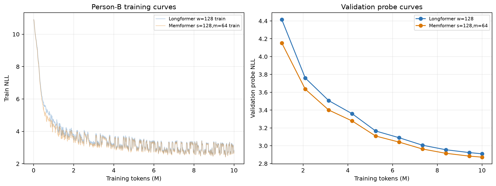
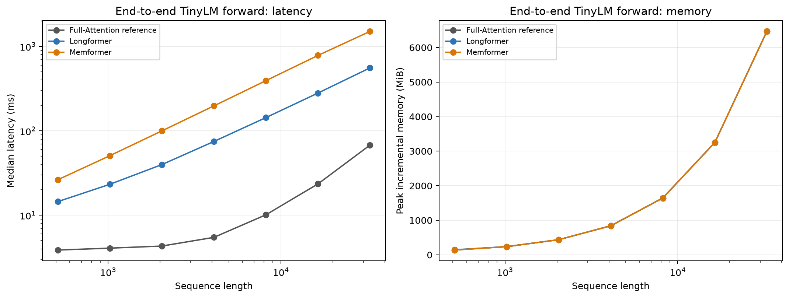

# B 角色实验结果速览：Longformer vs. Memformer

实验日期：2026-09-04  
任务：TinyLM + TinyStories validation screening  
硬件：单张 NVIDIA GeForce RTX 4090 24GB  

> **一句话结论：** 在本次单 seed、10M-token TinyStories screening 中，Memformer 的 validation 质量、训练吞吐和训练峰值显存优于 Longformer，但参数量更多，而且当前 Python/PyTorch 前向实现更慢；因此不能称为无条件全面优于 Longformer。

## 1. 实验条件

| 项目 | 固定设置 |
|---|---|
| 数据集 | `roneneldan/TinyStories`，固定 revision；无官方 test split |
| Tokenizer | `openai-community/gpt2`，每篇故事追加 EOS 后串接 |
| 公共 TinyLM | 6 层，hidden=384，8 heads，FFN=1536，Pre-LN，GELU，RoPE |
| 训练上下文 | 512 tokens |
| 训练预算 | 每个模型 10,000,000 tokens，1,221 optimizer steps |
| 有效 batch | 8,192 tokens（micro-batch=4，gradient accumulation=4） |
| 优化 | AdamW，lr=`3e-4`，3% warmup，cosine decay，BF16 autocast |
| 随机种子 | 17 |
| 完整验证规模 | 21,990 stories，4,765,917 next-token predictions |
| 冻结配置 | Longformer：left window=128；Memformer：segment=128、slots=64 |

## 2. 核心结果

箭头表示指标偏好：`↓` 越低越好，`↑` 越高越好。

| 指标 | Longformer | Memformer | Memformer 相对 Longformer | 本轮占优 |
|---|---:|---:|---:|---|
| 参数量 `↓` | **29,925,504** | 33,466,752 | +11.83% | Longformer |
| Validation NLL `↓` | 2.883914 | **2.845559** | -1.33% | Memformer |
| Validation PPL `↓` | 17.884141 | **17.211176** | -3.76% | Memformer |
| 统一训练流程吞吐 `↑` | 14,003.66 tok/s | **15,733.62 tok/s** | +12.35% | Memformer |
| 统一训练流程耗时 `↓` | 714.10 s | **635.58 s** | -11.00% | Memformer |
| Run peak allocated `↓` | 6.80 GiB | **2.63 GiB** | -61.28% | Memformer |
| Run peak reserved `↓` | 7.67 GiB | **3.93 GiB** | -48.83% | Memformer |

最直接的读法是：Memformer 用约 **11.8% 的额外参数**，换得约 **3.8% 的 PPL 降低**、**12.4% 的训练流程吞吐提升**和明显更低的训练运行峰值显存。由于只有一个 seed，PPL 优势应视为本配置下的趋势，而不是统计显著结论。

## 3. 分指标分析

### 3.1 生成质量

- 两个模型都稳定完成训练和完整 validation，最终 probe 同时是各自最佳 probe。
- Memformer 的完整 validation PPL 为 **17.211**，低于 Longformer 的 **17.884**。
- 10M tokens 结束时两条 validation 曲线仍在下降，所以这是短预算筛选结果，不能称为充分收敛结果。
- Memformer 参数更多，因此当前结果不能单独证明 recurrent memory 在严格等参数条件下更优。

### 3.2 训练资源

- Memformer 的统一训练流程吞吐高 **12.35%**，完成相同 token 预算少用约 **78.5 秒**。
- Memformer 的 run-level peak allocated 为 **2.63 GiB**，比 Longformer 低 **61.28%**。
- 这里的流程吞吐包含定期 validation probe 和 checkpoint 写入；峰值覆盖整个运行过程，不是单个 attention kernel 的显存。

### 3.3 长序列前向效率

下表是冻结 checkpoint 的完整 TinyLM 前向，格式为“中位延迟 / 吞吐”；batch=1、BF16，且包含完整词表 logits 投影。Full SDPA 只作为效率参考，没有独立训练质量结果。

| 序列长度 | Full SDPA | Longformer | Memformer |
|---:|---:|---:|---:|
| 512 | **3.873 ms / 132,205 tok/s** | 14.520 ms / 35,261 tok/s | 26.362 ms / 19,422 tok/s |
| 1,024 | **4.078 ms / 251,099 tok/s** | 23.295 ms / 43,958 tok/s | 50.841 ms / 20,141 tok/s |
| 2,048 | **4.319 ms / 474,215 tok/s** | 39.875 ms / 51,360 tok/s | 100.013 ms / 20,477 tok/s |
| 4,096 | **5.473 ms / 748,363 tok/s** | 74.896 ms / 54,689 tok/s | 197.842 ms / 20,703 tok/s |
| 8,192 | **10.136 ms / 808,244 tok/s** | 143.740 ms / 56,992 tok/s | 393.868 ms / 20,799 tok/s |
| 16,384 | **23.523 ms / 696,514 tok/s** | 280.707 ms / 58,367 tok/s | 783.836 ms / 20,902 tok/s |
| 32,768 | **67.832 ms / 483,077 tok/s** | 557.841 ms / 58,741 tok/s | 1,509.627 ms / 21,706 tok/s |

在 32K token 时，Longformer 延迟约为 Full SDPA 的 **8.22 倍**；Memformer 约为 Full 的 **22.26 倍**、Longformer 的 **2.71 倍**。这说明理论上的线性复杂度没有在当前 adapter 中自动变成速度优势，主要工程瓶颈包括 Python chunk/segment 循环、通用 kernel 调度和完整词表投影。

隔离成 32K token、单层 attention-only 后：

| 方法 | 中位延迟 `↓` | Peak incremental memory `↓` |
|---|---:|---:|
| Full SDPA | **8.174 ms** | 204.2 MiB |
| Longformer | 88.378 ms | 233.3 MiB |
| Memformer | 242.225 ms | **72.3 MiB** |

Memformer 的 attention 工作内存最低，但延迟最高。要把固定 memory 的结构优势转化为实际速度优势，需要 fused segment-memory kernel，而不是仅依赖当前 Python 实现。

### 3.4 长距离信息通路

诊断方法是替换输入最早的 128 个 token，并观察末端 logits 是否改变。

| 方法 | 观察结果 | 能支持的结论 |
|---|---|---|
| Longformer | 6 层 × left window 128，单 token 理论传播上限约 768；长度 1,024 起末端影响为 0 | 无 global token 时，远距可达性受层数和窗口限制 |
| Memformer | 长度 4,096 时末端最大 logit 差仍为 0.03125，但随距离增长而衰减 | Recurrent memory 建立了跨 segment 信息通路，但存在压缩衰减 |

该诊断只回答“早期输入是否还能影响末端”，不回答“模型能否准确找回某个早期细节”。本轮没有 passkey、copy、associative recall 或对话事实检索准确率。

## 4. 两种机制的取舍

| 方法 | 本轮主要优点 | 本轮主要代价 | 更适合优先验证的方向 |
|---|---|---|---|
| Longformer | 参数更少；机制简单；当前 adapter 前向比 Memformer 快 | 训练峰值显存较高；无 global token 时有明确局部传播边界 | 近期局部依赖、优化 sliding-window kernel |
| Memformer | PPL 略低；训练流程更快；训练峰值显存更低；存在跨 segment 路径 | 参数多 11.83%；当前前向更慢；固定槽反复压缩会衰减细节 | 跨段语义保留、动态重要性选择、fused memory kernel |

## 5. 结论边界

- 只有 `seed=17`，没有均值、标准差或显著性检验。
- 10M training tokens 是 screening 预算，不代表充分收敛。
- 模型只在 context=512 上训练；512 到 32K 的结果是效率和信息通路诊断，不是 32K 语言建模质量。
- TinyStories 由短故事组成，跨故事 packing 不等于真实的长期记忆场景。
- 两模型参数量不相等，且当前实现是 protocol adapter，不是原论文严格复现。
- 长度 32,769 的失败来自 RoPE 最大位置限制，不是显存 OOM。

## 6. 下一步优先级

1. 固定当前配置补齐 seeds 29、43，报告 validation NLL/PPL 的均值和标准差。
2. 增加 passkey、copy、associative recall 和话题切换后的细节恢复任务。
3. 增加等参数或等 FLOPs 对照，分离“额外参数”和“记忆机制”的贡献。
4. 将动态重要性保留作为 Memformer 基线之后的创新实验，依次验证 soft gate、hard top-k 和 active-slot packing。
5. 优化或融合 Longformer chunk 与 Memformer segment-memory kernel，再重复延迟测试。

## 7. 详细资料

- 详细实验文档：[PERSON_B_TINYLM_DETAILED_EXPERIMENT_DOCUMENT.md](PERSON_B_TINYLM_DETAILED_EXPERIMENT_DOCUMENT.md)
- 较完整结果报告：[PERSON_B_TINYLM_REPORT.md](PERSON_B_TINYLM_REPORT.md)
- 主结果 JSON：[person_b_final_summary.json](experiments/tinystories_tinylm_v1/aggregate/person_b_final_summary.json)
- 端到端效率 JSON：[person_b_efficiency.json](experiments/tinystories_tinylm_v1/aggregate/person_b_efficiency.json)
- Attention-only JSON：[person_b_attention_efficiency.json](experiments/tinystories_tinylm_v1/aggregate/person_b_attention_efficiency.json)
- 机制诊断 JSON：[person_b_cross_segment_influence.json](experiments/tinystories_tinylm_v1/aggregate/person_b_cross_segment_influence.json)

